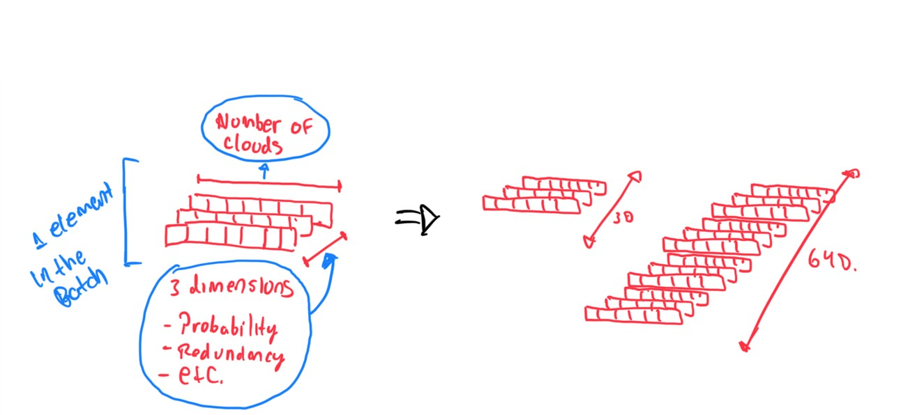

- [Ad-hoc pnet-network](#ad-hoc-pnet-network)
- [Installation](#installation)
- [Generic explanation](#generic-explanation)
  - [Batch and other considerations](#batch-and-other-considerations)
  - [Training](#training)
    - [1. Changing dimentionality](#1-changing-dimentionality)
    - [2. Generating the contex vector](#2-generating-the-contex-vector)
    - [3. Generating a solution](#3-generating-a-solution)
    - [4. Reward and update the weights](#4-reward-and-update-the-weights)
  - [Inference](#inference)


# Ad-hoc pnet-network

This newtork is an implemenation of a point network for resolve another kind of problem not related to the TSP (Travel salesman problem).

# Installation
In this repository was used `poetry` as package manager and `pyenv` as environment manager.

Once installed `poetry` and the correct Python version (managed by you or by `pyenv`) just do:
```bash
poetry install
# and then
poetry run src/main.py
# or
poetry shell # to activate the correct enviroment
```

There are multiple option to configure the network this con be displayed by:
```bash
poetry run src/main.py --help
```

# Generic explanation

## Batch and other considerations
The batch data is composed by $N$ elements (this are individual problems to the network) and every one has $n$ CSP(Cloud Service Provider)/items each one with $m$ stats. So we have a batch a with dimention $N,m,n$ (this form is a requeriment from Pytorch). This is the input to the network. For simplicity lets to avoid to use $N$ becuase is the same for all the elements.

This network ad-hoc has subtle problem to deal with: the solution are not only the items in some order as the TSP the solution is a subset ($n'$) of the original items list ($n$) plus a extra num ($k$) that is ruled by $k \leq n'$.

For that reason is necessary to make some changes to generate a valid solution. First two "fake items"/tokens are added to every element. The first one is as special token to stop to choose items (to be able to choose a subset ($n'$) of $n$ and the second one is for generate $k$ (by choosing this item multiple times).  The mask used in [step-3](#3-generating-a-solution) are conditions to enforce only valid solution using these tokens.

## Training

The structure is simple the main idea in this network is divided in four steps.
1. Change the dimentionality of the input to another with more dimentions.
2. The new input data go through a `RNN` (Recurrent NN) and the internal state (context vector) of the RNN is used as output to the next network.
3. The inputs is used as initial state for second RNN to genrate the output.
4. Reward is calculated and backpropagation is applied.

</br>

### 1. Changing dimentionality
The first step is to change the dimentionality of the data increasing $m$ with the help of a little `conv` layer to increse it to $m'$.



</br>

### 2. Generating the contex vector

Every $n$ (in some parts of code this is sometimes is called steps of the `RNN`) of the input is passed through a `RNN`  and finally the intern state is passed as output to the next network.


</br>

### 3. Generating a solution
The output of the previous step is charged as initial `RNN` state of this network. To start to generate solutions is necessary to introduce a  sintetic input first. After that the subsequent inputs in the `RNN` are the inputs generated in the step 1 and the order is determined by the selection of the pointer mechanism in conjuntion with the mask (this only avoid to choose invalid items and previously items chosen). The items that are valid to choose have a probability associate. For simplicity the network only takes the *arg-max* of every loop iteration.


</br>

### 4. Reward and update the weights

* The solution are passed to a function that defines the reward in pondered by objectives. Every objective is normalized by the maximum and minimum of every objective to avoid weirds things if the  objective is not normalizable then probably the network will not traing appropiately.
* Exist two main network involved in the training:
  * Pointer-net part: This network only produces solutions.
  * Critic: This network only tries to approximate the reward. All this for try to reduce the veriance through the training process (this work as baseline to denote improvement).
* Newtorks involved in the training procces (critic and pointer) are detached, this is: both networks are not aware of the existence of the other and don't share (weights). They only share the final result to make the backpropagation invidually.


</br>

## Inference
Inference works in the same way that training in the steps 1 to 3. Optionally show the result of the reward to compare results. But here the crictic is no used.